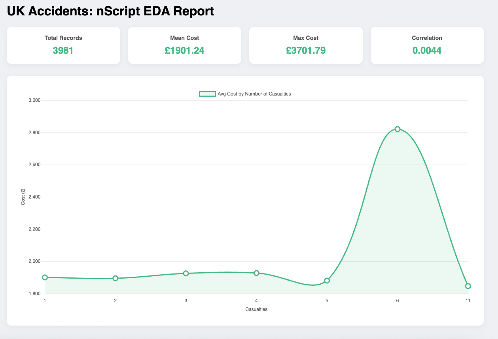

<a id="readme-top"></a>

[![Contributors][contributors-shield]][contributors-url]
[![Forks][forks-shield]][forks-url]
[![Stargazers][stars-shield]][stars-url]
[![Issues][issues-shield]][issues-url]
[![MIT License][license-shield]][license-url]
[![LinkedIn][linkedin-shield]][linkedin-url]

<br />
<div align="center">
  <a href="https://github.com/skidd104/nScript">
    
  </a>

<h3 align="center">nScript</h3>

  <p align="center">
    A high-performance C++ powered engine for Linear Algebra and Exploratory Data Analysis in Node.js.
    <br />
    <a href="https://github.com/skidd104/nScript"><strong>Explore the docs »</strong></a>
    <br />
    <br />
    <a href="https://github.com/skidd104/nScript">View Demo</a>
    &middot;
    <a href="https://github.com/skidd104/nScript/issues">Report Bug</a>
    &middot;
    <a href="https://github.com/skidd104/nScript/issues">Request Feature</a>
  </p>
</div>

<details>
  <summary>Table of Contents</summary>
  <ol>
    <li>
      <a href="#about-the-project">About The Project</a>
      <ul>
        <li><a href="#built-with">Built With</a></li>
      </ul>
    </li>
    <li>
      <a href="#getting-started">Getting Started</a>
      <ul>
        <li><a href="#prerequisites">Prerequisites</a></li>
        <li><a href="#installation">Installation</a></li>
      </ul>
    </li>
    <li><a href="#usage">Usage</a></li>
    <li><a href="#linearalgebra">LinearAlgebra</a></li>
    <li><a href="#eda">EDA</a></li>
    <li><a href="#license">License</a></li>
    <li><a href="#contact">Contact</a></li>
  </ol>
</details>

## About The Project 

<div align="center">
  
</div>

nScript is a specialized mathematical library that bridges the gap between JavaScript's ease of use and C++'s raw computational power. Designed for data analyst working with large datasets, it provides an optimized suite for multidimensional array manipulation, matrix operations, and comprehensive exploratory data analysis (EDA).

### Built With

* [![C++][CPP-shield]][CPP-url]
* [![Node.js][Node-shield]][Node-url]
* [![Node-API][Napi-shield]][Napi-url]

<p align="right">(<a href="#readme-top">back to top</a>)</p>

## Getting Started

### Prerequisites

To build the native C++ core, you need `node-gyp` and a C++ compiler installed on your system.
* npm
  ```sh
  npm install npm@latest -g
  ```

## Usage

### Arrays
```JavaScript
const array1 = numscrpt.array([1,2,3,4,5]);
const array2 = numscrpt.array([1,2,3],[4,5,6]);
const array3 = numscrpt.array([[[1,2,3],[4,5,6]], [[1,2,3]]]);
const array4 = numscrpt.array([[1,2],[3,4],[5,6]]);
```

### Shape
```JavaScript
const Shape = numscrpt.shape(array);
```

### Sum 
```JavaScript
const Sum = numscrpt.sum(array);
```

### Zeros
```javascript
const zeros = numscrpt.zeros([3,4]);
const zeros = numscrpt.zero(5);
```

### Reshape
```javascript 
let arr = numscrpt.array([1,2,3,4]);
let reshapedArr = numscrpt.reshape(arr, [2,2]);
//Error Case
let reshapedArr = numscrpt.reshape(arr, [2,3]);
```

### Ndim
```JavaScript
const d1 = numscrpt.array([1,2,3]);
const d2 = numscrpt.array([[1,2,3],[4,5,6]]);
const d3 = numscrpt.array([[[1,2,3], [4,5,6]], [[1,2,3], [4,5,6]]]);
const dimension = numscrpt.ndim(d3);
```

### Size 
```javascript
const flatArr = new Float64Array([1,2,3,4]);
const multArr = ([[1,2,3],[4,5,6]]);
const totalSize = numscrpt.size(multArr);
```

### Dtype 
1.)Casting a 3D Nested Array to a Flat Int32Array
```javascript
const d3 = [[[1.1, 2.2], [3.3, 4.4]]];
const intArr = numscrpt.dtype(d3, 'i');
```

2.)Casting to Strings
```javascript
const strArr = numscrpt.dtype([10.5, 20.9], 'S');
```
3.)Simple Operations
```javascript
console.log(numscrpt.dtype(intArr);
```


### Add
```javascript
//1D Add Operations
const a = [1,2,3];
const b = [10,20,30];
console.log (numscrpt.add(a, b));

//2D Add Operations
const matrix1 = [[1,1], [1,1]];
const matrix2 = [[5,5], [5,5]];
console.log(numscrpt.add(matrix1, matrix2));

//Error Case
numscrpt.add([1,2], [1,2,3]);
```

### Mean
```javascript
//1D Declerations
console.log(numscrpt.mean([1, 2, 3, 4, 5]));

//2D Array
const matrix = [
   [10, 20],
    [30, 40]
];
console.log(numscrpt.mean(matrix));

//3D Array
const d3 = [ [[1, 1], [1, 1]], [[2, 2], [2, 2]] ];
console.log(numscrpt.mean(d3));
```

### Flatten
```javascript
const matrix = [[1,2,3], [4,5,6]];
const flat = numscrpt.flatten(matrix);

```

### Transpose
```javascript
const matrix = [
    [1,2,3],
    [4,5,6]

];
const flipped = numscrpt.transpose(matrix);

```

## LinearAlgebra

### Dot
```javascript
const A = [
    [1,2,3],
    [4,5,6]
];

const B = [
    [7, 8],
    [9, 10],
    [11, 12]
];
const result = numscrpt.dot(A, B);

```

### Inverse
```javascript
const A = [
    [4, 7],
    [2, 6]
];

const invA = numscrpt.inv(A);
const clean = (matrix) => {
    return matrix.map(row => 
        row.map(val => Math.abs(val) < 1e-10 ? 0 : val)
    );
}
const result = numscrpt.dot(A, invA);

```

## EDA
Exploratory Data Analysis

### Std
```javascript
const lowSpread = [10, 11, 10, 9, 10];
console.log(numscrpt.std(lowSpread)); 

const highSpread = [0, 10, 20, 30, 40];
console.log(numscrpt.std(highSpread)); 

const matrix = [[1, 2], [10, 20]];
console.log(numscrpt.std(matrix));

```

### Min-Max
```javascript
const stockPrices = [
    [150.25, 155.10, 148.00],
    [152.00, 158.50, 151.20]
];

const low = numscrpt.min(stockPrices);
const high = numscrpt.max(stockPrices);

console.log(`The chart range should be: ${low} to ${high}`);

```

### Median
```javascript
console.log(numscrpt.median([10, 2, 38, 23, 38])); 
console.log(numscrpt.median([10, 2, 38, 23])); 
const prices = [[200], [250], [10000]];
console.log(numscrpt.median(prices)); 
```

### Variance
```javascript
const data = [1, 2, 3, 4, 5];

const variance = numscrpt.var(data);
const stdDev = numscrpt.std(data);

console.log("Variance:", variance); 
console.log("Std Dev:", stdDev);     

console.log(numscrpt.var([[10, 20], [30, 40]])); 
```

### Column
```javascript
const dataset = [
    [25, 50000, 1], // [Age, Salary, Remote]
    [30, 60000, 0],
    [45, 95000, 1],
    [22, 42000, 0]
];

const salaries = numscrpt.column(dataset, 1); 

const avgSalary = numscrpt.mean(salaries);
const maxSalary = numscrpt.max(salaries);
console.log(`Average Salary: ${avgSalary}`);
```

### Row
```javascript
const dataset = [
    [1, 250000], // ID, Price
    [2, 310000],
    [3, 10000000] 
];

const prices = numscrpt.column(dataset, 1);
const maxVal = numscrpt.max(prices);
const outlierIndex = Array.from(prices).indexOf(maxVal);

const record = numscrpt.row(dataset, outlierIndex);
console.log("Full Record of Outlier:", record);
```

### Slice

```javascript
const dataset = [
    [1, "Alice"],
    [2, "Bob"],
    [3, "Charlie"],
    [4, "David"],
    [5, "Eve"]
];

const chunk = numscrpt.slice(dataset, 1, 4);
```
### IsNaN
```javascript
const sensorData = [10.5, NaN, 12.1, 11.8, NaN];

const mask = numscrpt.isnan(sensorData);
console.log(mask); 

const missingCount = mask.filter(x => x === true).length;
if (missingCount > 0) {
    console.log(`Warning: You have ${missingCount} holes in your data!`);
}
```

### DropNA
```javascript
const dataset = [
    [10, 20, 30],
    [5, NaN, 15], 
    [1, 2, 3],
    [NaN, 0, 0] 
];

const cleaned = numscrpt.dropna(dataset);

console.log(cleaned.length); 
console.log(cleaned); 
[
  [10, 20, 30],
  [1, 2, 3]
]
```

### FillNa
```javascript
const dataset = [10, NaN, 30, NaN, 50];

const zeros = numscrpt.fillna(dataset, 0); 

const average = numscrpt.mean(numscrpt.dropna(dataset));
const scientific = numscrpt.fillna(dataset, average);
```

### Correlation
```javascript
const studyHours = [1, 2, 3, 4, 5];
const testScores = [52, 60, 71, 84, 95];

const relationship = numscrpt.corr(studyHours, testScores);
console.log(`Correlation: ${relationship.toFixed(4)}`); 

const randomNoise = [99, 2, 45, 12, 7];
console.log(numscrpt.corr(studyHours, randomNoise)); 
```
[contributors-shield]: https://img.shields.io/github/contributors/skidd104/nScript.svg?style=for-the-badge
[contributors-url]: https://github.com/skidd104/nScript/graphs/contributors
[forks-shield]: https://img.shields.io/github/forks/skidd104/nScript.svg?style=for-the-badge
[forks-url]: https://github.com/skidd104/nScript/network/members
[stars-shield]: https://img.shields.io/github/stars/skidd104/nScript.svg?style=for-the-badge
[stars-url]: https://github.com/skidd104/nScript/stargazers
[issues-shield]: https://img.shields.io/github/issues/skidd104/nScript.svg?style=for-the-badge
[issues-url]: https://github.com/skidd104/nScript/issues
[license-shield]: https://img.shields.io/github/license/skidd104/nScript.svg?style=for-the-badge
[license-url]: https://github.com/skidd104/nScript/blob/master/LICENSE.txt
[linkedin-shield]: https://img.shields.io/badge/-LinkedIn-black.svg?style=for-the-badge&logo=linkedin&colorB=555
[linkedin-url]: https://www.linkedin.com/in/michael-ian-leguira-a5b9793aa/
[product-screenshot]: images/cover.png

[CPP-shield]: https://img.shields.io/badge/C++-00599C?style=for-the-badge&logo=c%2B%2B&logoColor=white
[CPP-url]: https://isocpp.org/
[Node-shield]: https://img.shields.io/badge/Node.js-339933?style=for-the-badge&logo=nodedotjs&logoColor=white
[Node-url]: https://nodejs.org/
[Napi-shield]: https://img.shields.io/badge/Node--API-FFD700?style=for-the-badge&logo=node.js&logoColor=black
[Napi-url]: https://nodejs.org/api/n-api.html
